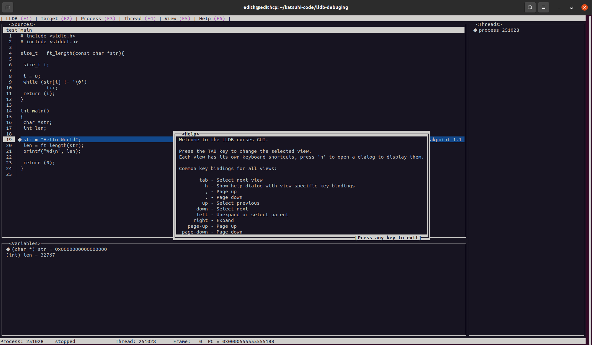

# :dart: **LLDB Debugger in C (Linux)**
Using **LLDB** (Low-level Debugger)  to debug code in **C**, with a Graphical User Interface on Linux that makes it easier to find bugs in our code.
You can find more about lldb, here: https://lldb.llvm.org/

## :page_facing_up: **How to install in Linux**
```console
sudo apt-get install lldb
#Checking the installation
lldb --version
```

## :feet: **Debug with lldb and GUI**
```bash
gcc -g main.c
```
* **"gcc"** compiler
* **"-g"** flag to include debugging information in the generated binary

```bash
edith@edithcp:~/katsuhi-code/lldb-debuging$ lldb test 
(lldb) target create "test"
Current executable set to '/home/edith/katsuhi-code/lldb-debuging/test' (x86_64).
(lldb) b main
Breakpoint 1: where = test`main + 12 at main.c:19:6, address = 0x0000000000001188
(lldb) run
Process 251028 launched: '/home/edith/katsuhi-code/lldb-debuging/test' (x86_64)
Process 251028 stopped
* thread #1, name = 'test', stop reason = breakpoint 1.1
    frame #0: 0x0000555555555188 test`main at main.c:19:6
   16  		char *str;
   17  		int len;
   18  	
-> 19  		str = "Hello World";
   20  		len = ft_length(str);
   21  		printf("%d\n", len);
   22  		
(lldb) gui
```

| **Command** | **Description** |
| ------------- | ------------- |
| **lldb a.out**  | with lldb and the name of the binary, we start the debug mode  |
| **b main**  | With b we are setting a breakpoint at the start of function "main"  |
| **run** | Then  “run” the loaded program |
| **gui** | To open the Graphical User Interface window |


## :raising_hand: **Basic keys to use the graphical user interface**

| **key** | **Description** |
|-------------|-----------------|
| **tab** | move between the windows |
| **s** | to do a single step in the code |
| **arrow keys** | To move the text cursor to the right, left, previous line and, next line and navigate between the variables |
| **h** | to show help window |
| **escape** | to leave of the lldb debug mode |


## **lldb - GUI**



## **Youtube Video**
- https://youtu.be/2Yw1chhv7UQ

### :clap: **Note**
- My thanks to **Greg Clayton**  who is the creator of **GUI mode for lldb**, who was willing to answer all my questions about it!